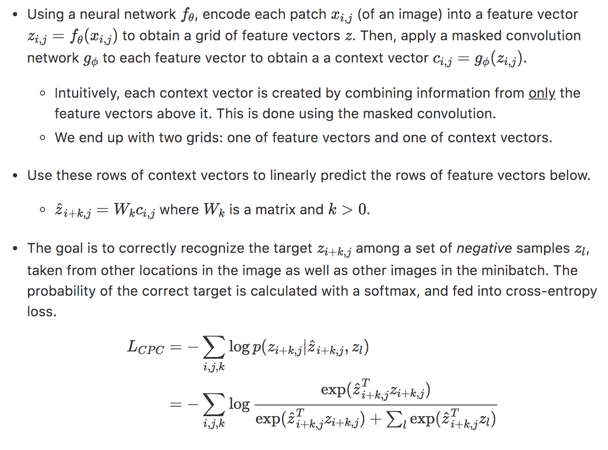

### PyTorch implementation of CPC, V2

This repository was inspired by [Data-Efficient Image Recognition with Contrastive Predictive Coding](https://arxiv.org/abs/1905.09272). 

**Summary**: CPC encodes the input into a sequence of representations, then predicts future observations from past ones. 

